*This is a report for CS45053 written by Geoffrey Natin 14138196*

# Locating & Recognising Paintings in Galleries

This report is on an OpenCV program developed to locate and recognise paintings in images of Galleries.  

## Contents

1. Introduction
2. Overview of Solution
3. Technical Details of Solution
4. Results
5. Discussion of Results
6. Closing Notes for Improvement

## 1. Introduction

The problem is to locate and recognise paintings in galleries. An OpenCV program was developed to take in images of galleries, locate the paintings within the images, and match the paintings found with images of paintings known to be in the galleries.  

The paintings in the gallery images are assumed to take up at least 150x150px of the image. This assumption is used to get rid of objects that are not of interest in the gallery image with similar properties to paintings.  

The walls of the galleries in the images are assumed to be a single colour, as is usual in an Art gallery so as to not distract from the art. This assumption helps to detect the non-wall components of the gallery image.  

The paintings are also assumed to be somewhat rectangular (*somewhat* specifically meaning that they take up 60% of their bounding rectangle in the image). This assumption helps to eliminate parts of the wall and ceiling that may be in the gallery image.

## 2. Overview of the Solution

To recognise the paintings in an image, the program:
1. Performs Mean-Shift Segmentation on the image.
2. Creates a mask of the largest segment.
3. Performs Connected Components on the mask to get non-wall components.
4. Refines the list of components found.
5. Erodes each component to get rid of noise attached to the frames.
6. Performs a Median Filter to smooth the the sides of the frame.
7. Performs Canny Edge detection to get the outline of the frame.
8. Performs Hough Lines on the edge image to get the vertical and horizontal edges of the painting.
9. Creates a new mask with the painting edges drawn across it.
10. Creates a new mask with just the painting component from the previous mask.
11. Performs Harris corner detection on the painting component to get its corners.
12. Uses the corners to perform an Affine Transformation on the painting in the gallery image.
13. Uses Scale Invariant Feature Transform to match the transformed painting image to the saved painting images.
14. In the case that no matches are found using SIFT, a histogram comparison is done on the transformed image with the saved images to find the best match.

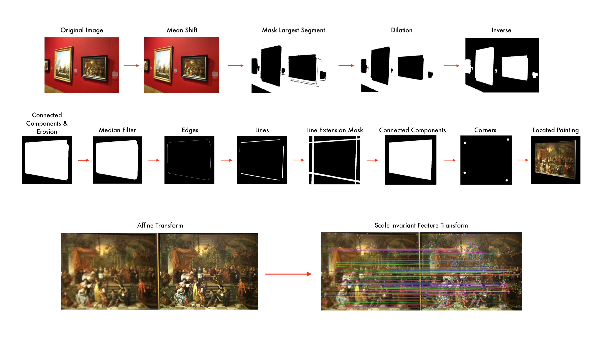

## 3. Technical Details of Solution

To aid the description of the process of locating and recognising a painting in an image, we will use the example of locating and finding the painting *'Wedding Feast at Cana'* in this gallery image.

*(We are not searching for 'Wedding Feast at Cana' in this image. We are detecting that the painting in this image is 'Wedding Feast at Cana'.)*

**Wedding Feast at Cana:**  

**Original test image:**  
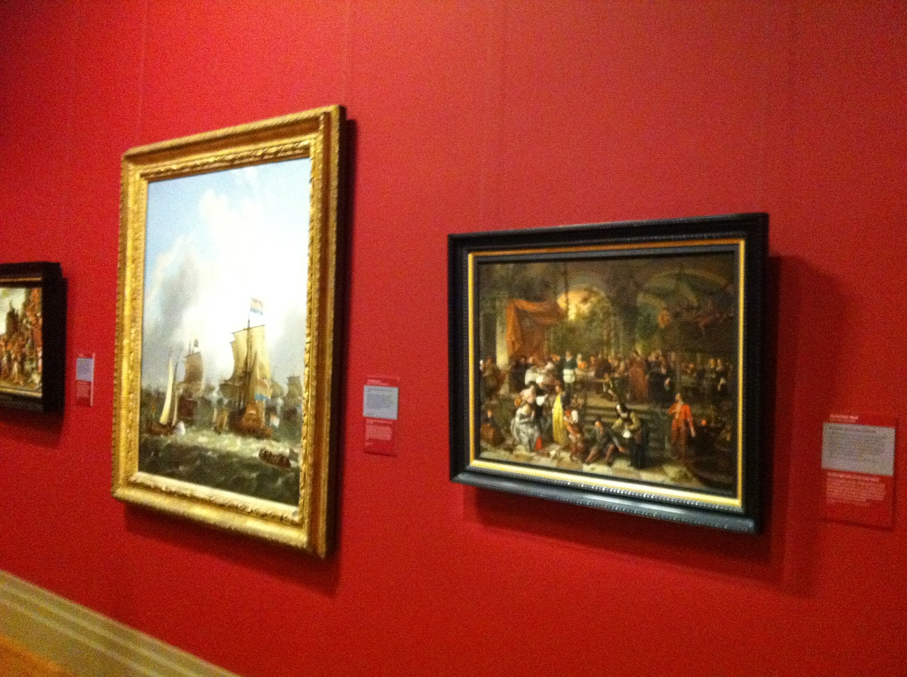

### Step 1: Perform Mean Shift Segmentation on the Image.

Paintings are objects on the wall in galleries. The program starts by finding the components in the image that are not the wall. The program performs Mean Shift Segmentation on the image, which groups pixels together by colour and location. The largest segment is then taken to be the wall.

Mean shift segmentation clusters nearby pixels with similar pixel values and sets them all to have the value of the local maxima of pixel value.

**Result of mean-shift-segmentation:**  

### Step 2: Create a Mask of the Largest Segment

A mask is then made using the largest segment (this segment being the wall). This is done by setting every pixel that is not the same color of the wall to have a value of zero and every pixel has a value within a euclidean distance of 2 to the wall's pixel value to have a value of 255.

**Wall Mask:**  
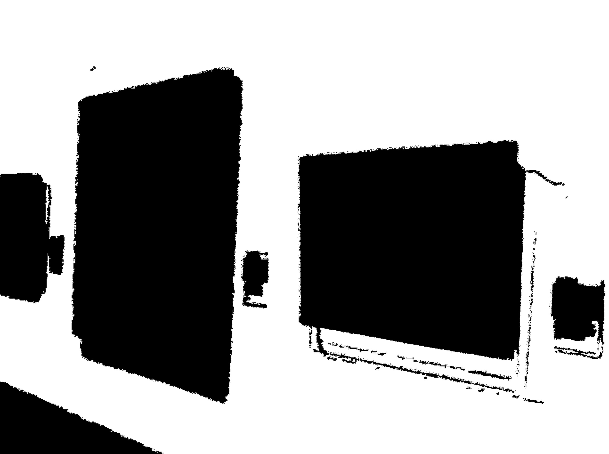

### Step 3: Dilate the Wall to remove Noise

To remove noise from the wall mask image, it is dilated.

Dilation involves moving a structuring element across the pixels of a binary image. When the structuring element is centered on a pixel with a value of 0 and some of its pixels are on pixels with a value of 255, the centre pixel is given a value of 255.

**Dilated wall mask image:**
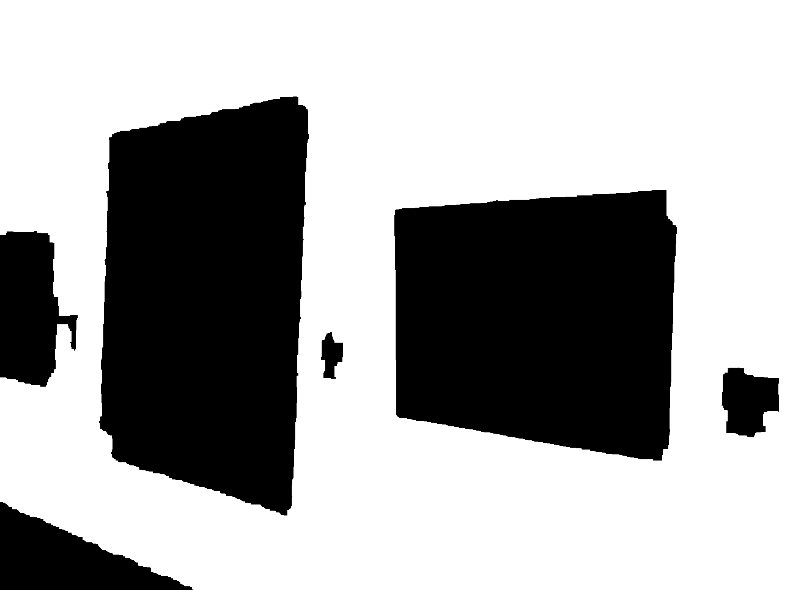

### Step 3: Invert the wall mask

In connected components analysis, pixels with a value of 255 are considered components. So as the objects of interest currently have a value of 0 in our mask image, the mask image is inverted.

To invert our binary image pixels with a value of 0 are set to have a value of 255, and pixels with a value of 255 are set to have a value of 0.

**Inverted wall mask image:**  
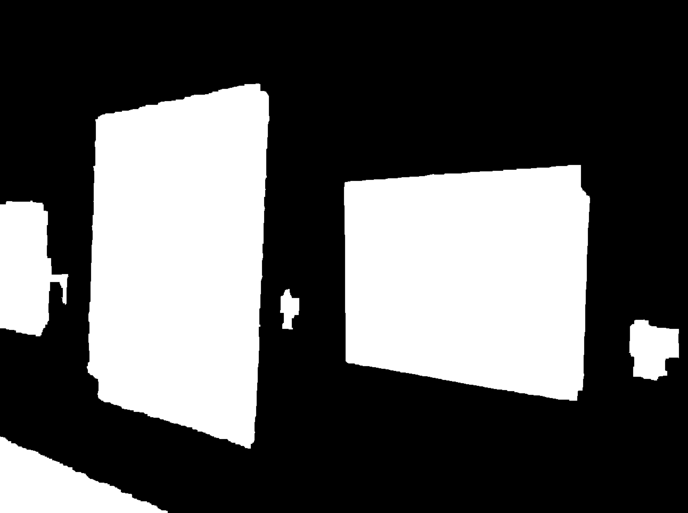

### Step 4: Connected Components Analysis

Next, the program performs connected components analysis on the binary image in order to find the points of each component in the image. Some of these components will be paintings in the gallery.

The algorithm for connected components involves:

1. Stepping through the pixels, and:
  * If their value is not zero, and their previous neighbours are: assign them a new label to note that they are part of a new component.
  * If their value is not zero and neither are their previous neighbours: assign them the same label as their neighbours to note that they are part of the same component. *(If some of their previous neighbours have different labels, join them up to have the same label)*

2. Passing over the image once more to set labels of components that are connected to have the same label value.

Once connected components analysis has been performed on the image, there is a record of the points that are contained in every component.

**TODO: Stretch goal: Each component in the image flood filled to a different colour, to show that the components have been found:**  

### 5: Refine list of components found

At this stage we almost have a list of the components that represent the framed paintings in the gallery images. As you can see from the above image, our list of components also contains non-painting components *(Such as the floor and signs with information about the paintings)*. To deal with this, the program introduces criteria for the components to be considered possible paintings.  

The components must be:
* At least 150*150 pixels in the image.
* At least 60% of their bounding rectangle in the image.

These criteria restrict paintings that are able to be located and recognised by the program. It is a possibility that some paintings that are different shapes than quadrilaterals, such as circles or triangles may not be categorised as paintings by the program. Also, very small paintings or pictures of paintings that have been taken very far away from the painting might not work either, if they do not fall under these criteria.

**TODO: Stretch goal: Each painting component in the image flood filled to a different colour, to show the reduced component list:**  

### 6: Erode components to remove things attached to the frames

At this stage, some components may still have objects outside the frame within them. To get rid of this, we erode each component. This is not necessary with our example painting, but the image below illustrates the need for this step.

The erosion also serves as a way of removing some of of the frames of paintings within the components. Many attempts were made to accurately find the sides of the painting within the frame, but were not included because they were not as reliable as simply eroding the components, and made assumptions about the content in the paintings. Using a technique such as Hough Lines to find lines that represent the inside of the frame makes the assumption that there are no lines inside the painting. Trying to separate the frame from the painting by color makes the assumption that the frame is a different color than the edges of the painting. This might seem like an understandable assumption to make, but this technique didn't work separating the frames from painting in some of the test images. There was particular difficulty with the painting *'A View of the Rye Water near Leixlip'* in the third and fourth gallery test image.

Erosion could be described as the opposite of dilation. In erosion, the centre of the structuring element is placed at every pixel in the binary image. The output of the erosion of the binary image has pixels set to 255 in every position where the structuring element was only on pixels with a value of 255 when centred on that pixel in the original image. The rest of the pixels in the erosion's output are set to 0.

**Example of why erosion of the components is necessary:**
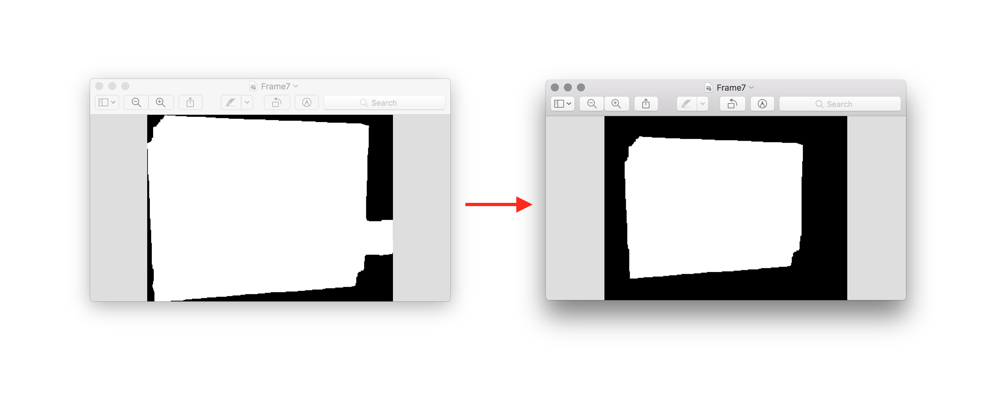

**The example component after erosion:**  

### 7: Median Filter to smooth the the sides of the frame

To best find the lines that represent the vertical and horizontal edges of the painting component, a Median Filter is applied to the eroded components to smooth their outline.

A median filter sets the value of every pixel in an image with the median value of its neighbouring pixels.

**The result of the application of a Median Filter:**  
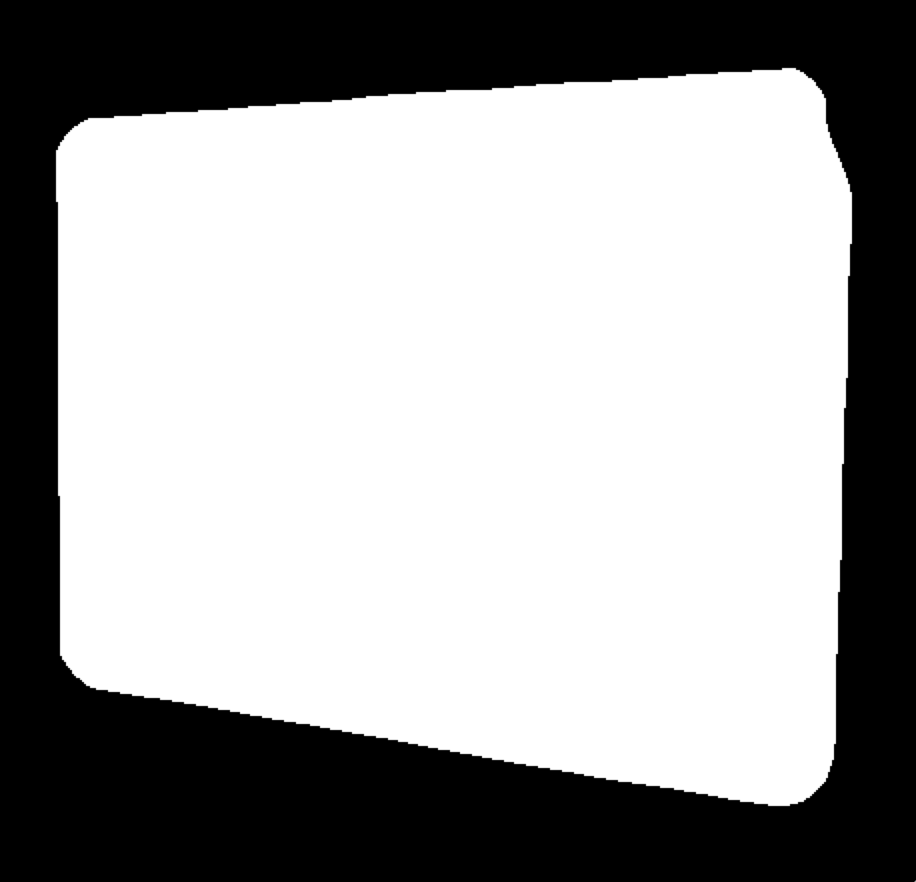

### 8: Canny Edge detection to get the outline of the frame

In order to perform Hough Lines to get the vertical and horizontal edges of the painting, we need to get an edge image. Canny edge detection is performed on the component to get the edge image.

Canny edge detection involves looking at the rate of change of the brightness values in the pixels in versions of the image that have been Gaussian Blurred to different extents. Gaussian Blur involves setting every pixel's value to be a weighted average of its neighbouring pixel's values. In Canny edge detection, each pixel is checked to see how much the brightness changes from one side of it to the other for many orientations and in many gaussian blurred versions of the image. As edges can be represented as a gradual change of brightness over many pixels, Canny uses the local maxima.

**The edge image of the component:**  
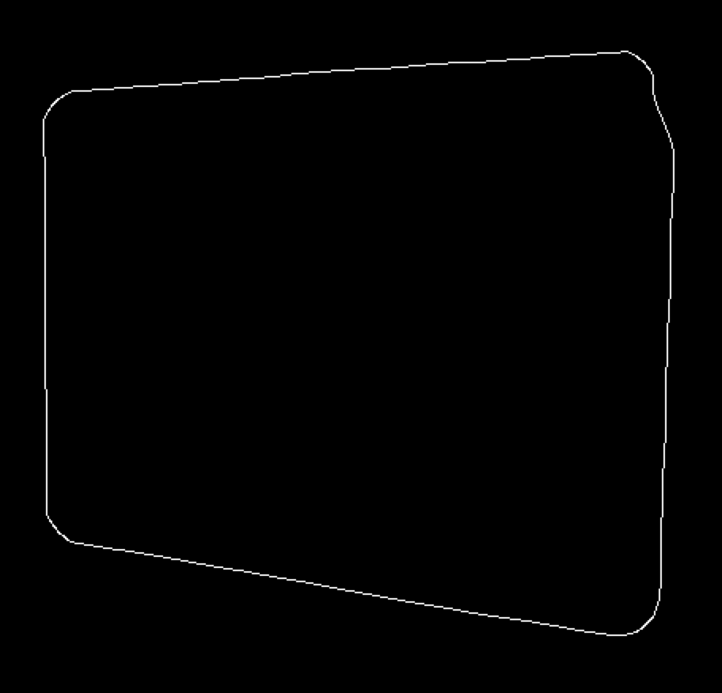

### 9: Hough Lines to get the vertical and horizontal edges of the paintings

The edge image is searched for lines who's length is at least a certain percentage of the component's bounding rectangle's larger side *(15%)*.

Lines can all be represented as an orthogonal distance to the origin and an angle of the line to an axis. In Hough Lines, an 'accumulator' of 'cells' is created that represents different combinations of distance and angle. For every edge point in the image, all cells that represent a line that runs through that point are incremented. Then the accumulator is searched for local maxima.

**The lines found in the component's edge image:**  
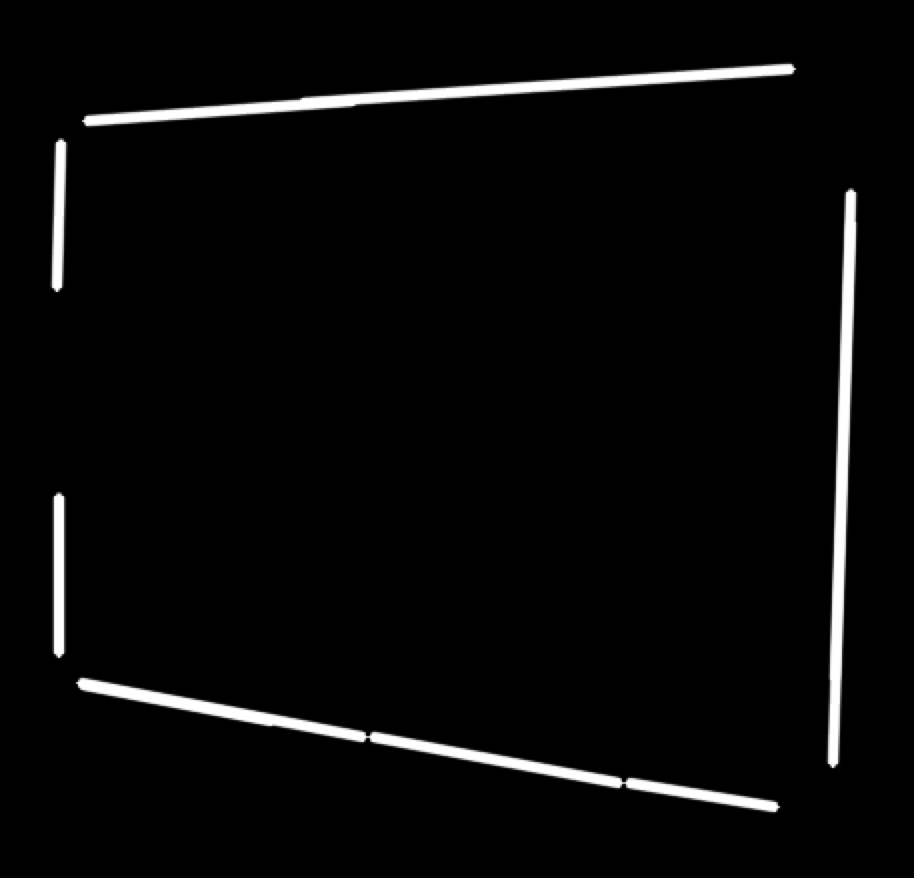

### Create a mask from the painting's edges

Using the lines from hough lines, a mask is created to isolate the component that is enclosed by the lines. This is necessary to get the four corners needed to apply an Affine Transformation on the painting for recognition.

A mask of the image is created, with every pixel set to have a value of zero. Then each line that was found is extended to reach across the entire image and drawn onto the mask. The thickness of the lines drawn onto the mask helps with further removal of possible frame pixels in the painting component and works well in representing multiple lines that represent the same edge of the painting as one line in the mask.

**The mask of the vertical and horizontal lines of the painting:**  
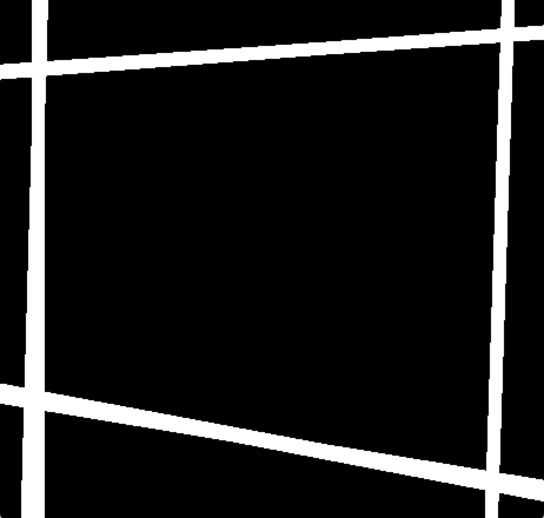

### Isolate Painting component from mask

The largest component from the *sudoku-like* mask is taken and drawn on a new mask, so that this mask can be used to find the four corners necessary for the transformation.

**The isolate painting component:**  
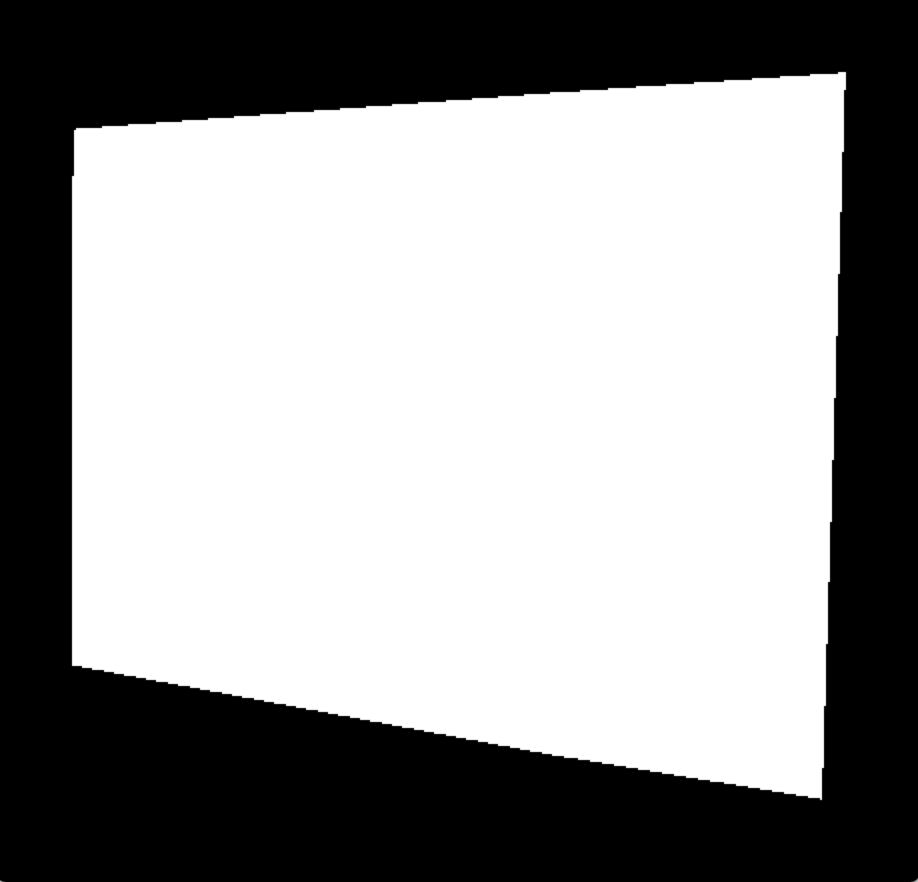

 At this stage, components that were not found to have 4 sides in the image are dropped, because we will the program will not be able to recognise the paintings if the proper edges have not been found. This causes the following painting to not be successfully recognised:

 **Example of painting locating failure:**  
 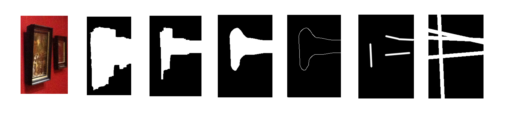

### Corner Detection on painting component

The mask of the painting component is used to find the corners necessary to transform the located painting before comparing it to the saved images of the paintings. The program uses Harris corner detection to locate the corners in the mask.

Harris corner detection works by looking at regions of the image that generate a lot of variation when moved around. Windows of the image are taken and compared to overlapping windows in the image to see how much of a variation there is when the window is moved.

**The corners of the painting mask having been found:**  
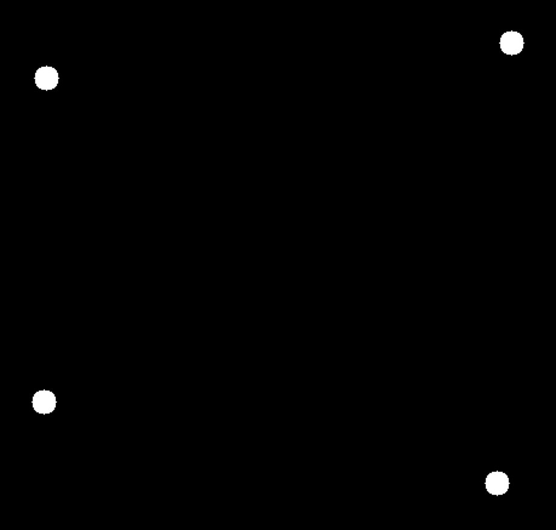

### Transform the located painting

In order to compare the features of the located painting and the saved images of the paintings from the galleries, the program performs an Affine Transformation on the paintings using the corners found. The located paintings are transformed to have the same dimensions as whatever painting is is being compared to in the following step.

**An example of the located painting being transformed to the same dimensions as a painting it is compared to:**  

### Match features from the located painting to saved painting images

The program uses Scale Invariant Feature Transform (*SIFT*) to find features in the paintings, and checks how many matches the located painting has with each of the saved paintings. The painting with the highest amount of matches is chosen as the painting to classify the located painting as.

< TODO: How does SIFT work? How does the comparing of the features to get 'matches' work? >

**Matches between the located painting and the corresponding saved painting:**  

### Histogram Comparisons for paintings with no feature matches

In the event that there are no sufficient (*TODO: by sufficient, we mean with a distance of less than 150 (what does this mean?)*) matches with any saved painting for a located painting, a histogram comparison is for every saved painting in order to see which saved painting has the most similar histogram to the located painting. The painting with the best matching histogram is chosen as the painting to classify the located painting as.

< TODO: Write up how the histograms are got, how the comparisons are done, what the comparison method used is >

Only one of the located paintings from the test images needed this extra step, and it is shown below.

**Located painting with no sufficient matches:**  

## 4. Results

An average DICE coefficient was calculated for each test image with the equation:
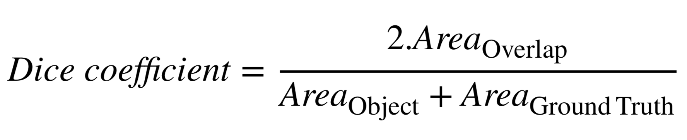

The Accuracy, Recall & Precision of the program for each test image was also calculated for each test image using the following equations:  

*(TP = True Positive, TN = True Negative, FP = False Positive, FN = False Negative)*

A correct recognition of a painting is considered a True Positive, and an unrecognised painting is considered a False Negative. An incorrect recognition of a painting would be considered a False Positive.

The program is not classifying that a painting is not present. Therefore all occurrences of TN in the above equations are set to zero.

Here are the calculated metrics for test each image (the first images are the results of the program, and the second images are the suggested ground truths):

### 'Gallery 1'
Metric|Result|
---|---|
Average DICE Coefficient|**0.923550**
Accuracy|1
Recall|1
Precision|1

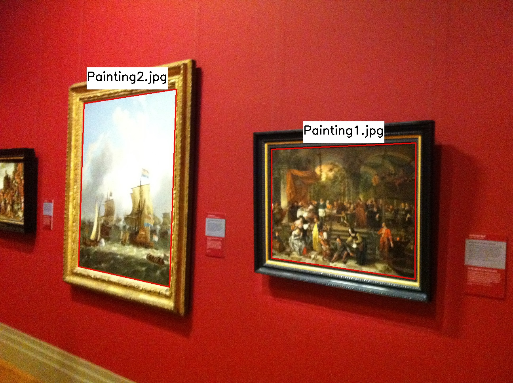

### 'Gallery 2'
Metric|Result|
---|---|
Average DICE Coefficient|**0.742338**
Accuracy|0.666666
Recall|1
Precision|1

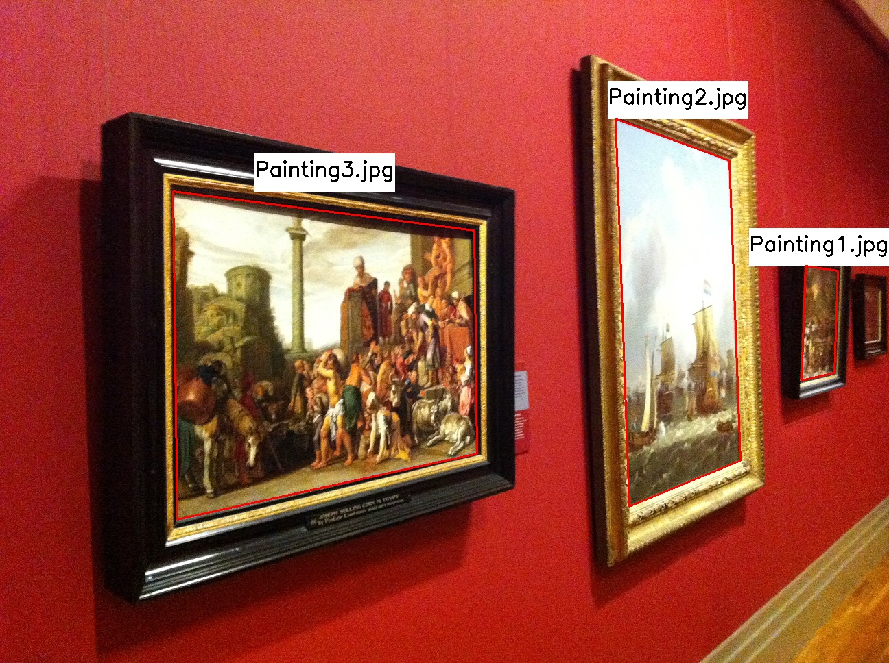

### 'Gallery 3'
Metric|Result|
---|---|
Average DICE Coefficient|**0.889543**
Accuracy|1
Recall|1
Precision|1

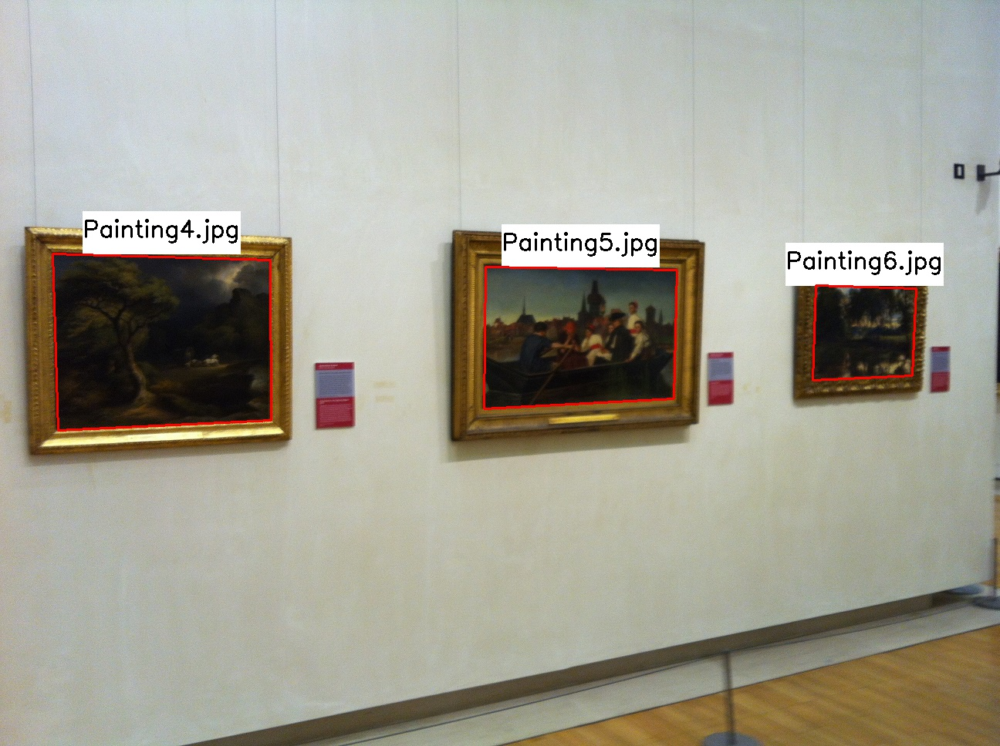

### 'Gallery 4'
Metric|Result|
---|---|
Average DICE Coefficient|**0.841582**
Accuracy|1
Recall|1
Precision|1

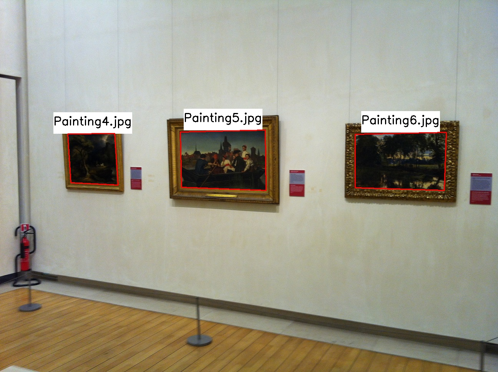

Here are the average metrics across all 4 test images:  

Metric|Result  
---|---|
Average DICE coefficient|**0.849253**
Accuracy|10/11 TODO: Do these and make sure you get the right answer
Recall|1
Precision|1

## 5. Discussion of Results

## 6. Closing Notes for Improvement
